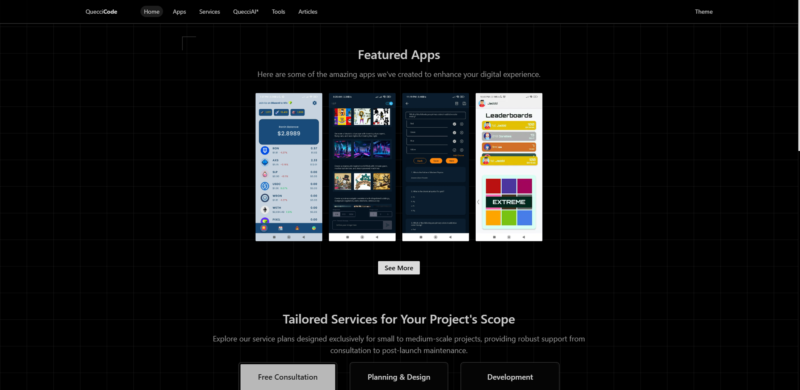
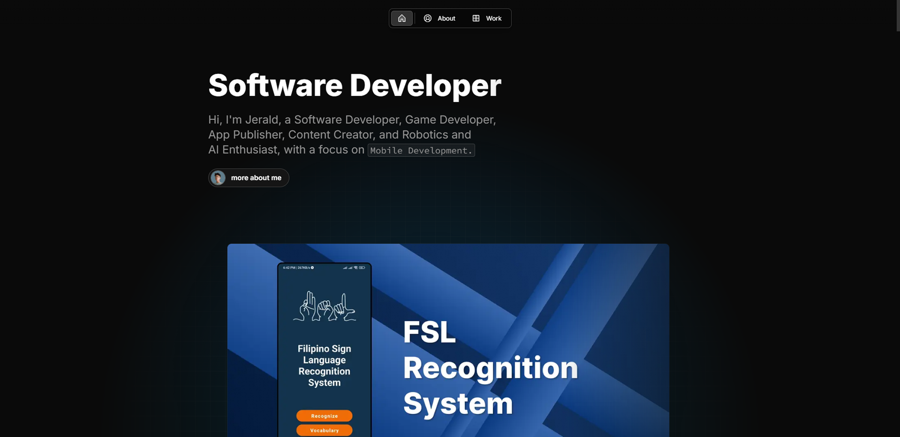

# Tech Stack

### 
🚀 Frameworks & Libraries

  
  
    
     
   
   
  

### 
🛠 Development Tools

  
  
  
  
  
  

### 
💻 Languages

  
  
  
  
  
  
  

### 
☁️ Cloud & Databases

  
  
  
  
  

### 
🎨 Design & UI/UX

  
  
  
  

### 
📦 Package Managers & Version Control

  
  
  

### 
🌐 Visit My Websites

  
  

  
  

