# 🚀 Tech Stack

A collection of frameworks, tools, libraries, and services I work with.

## 🛠️ Frameworks

  
  
   
  
  
  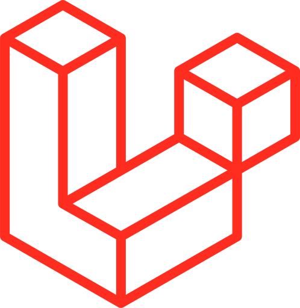 
  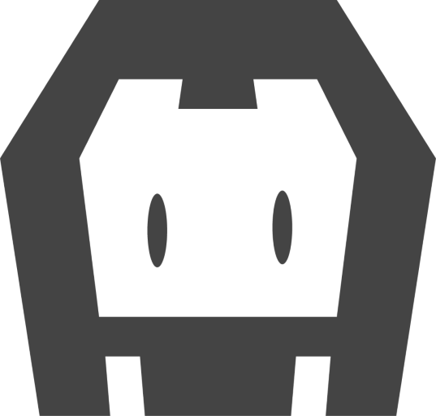 

## ⚙️ Tools

  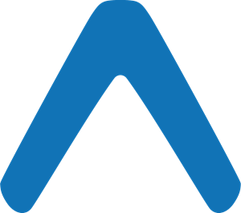
  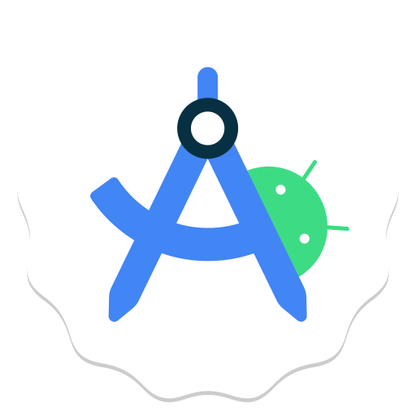
  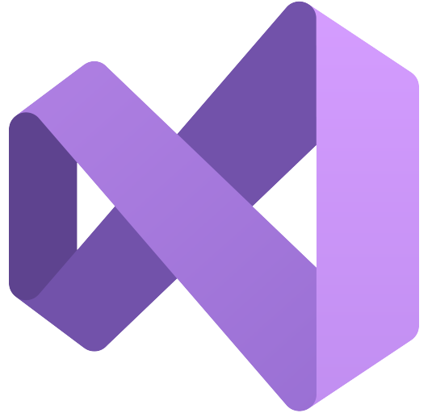
  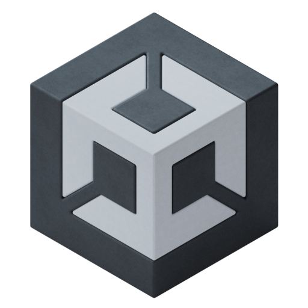
  
  
  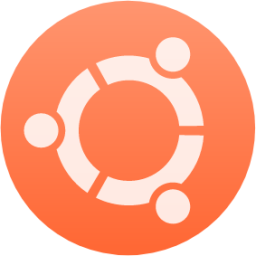
  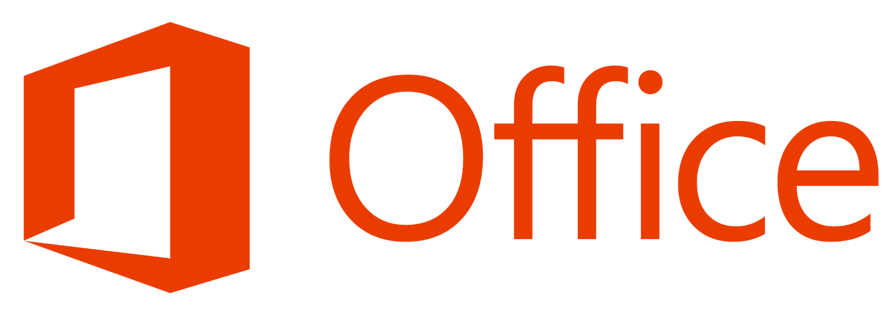
  

## 📚 Libraries

  
  
  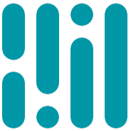

## 💻 Programming Languages

  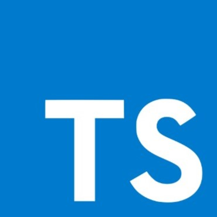
  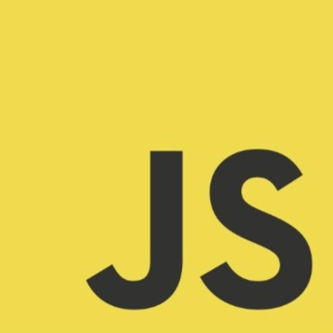
  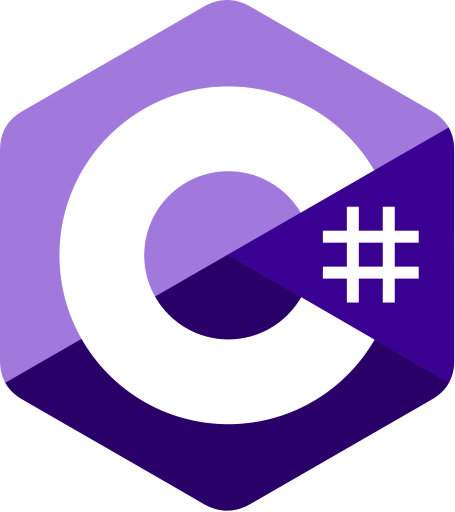
  
  
  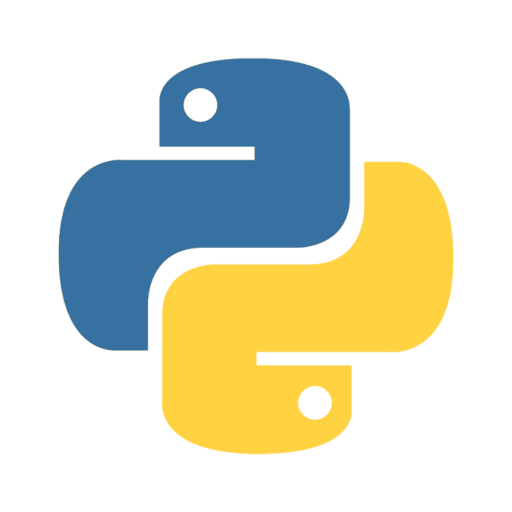
  

## ☁️ Services

  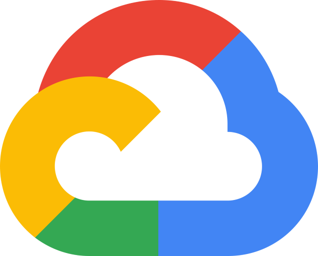
  
  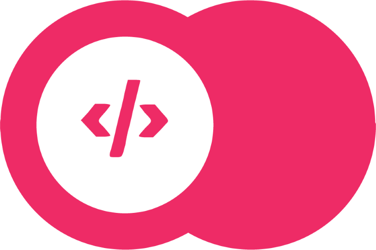

## 🗄️ Databases

  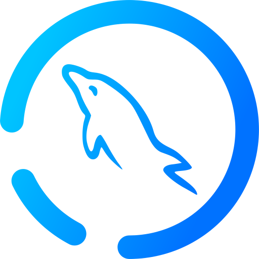

          

## 🎨 UI/UX Design

  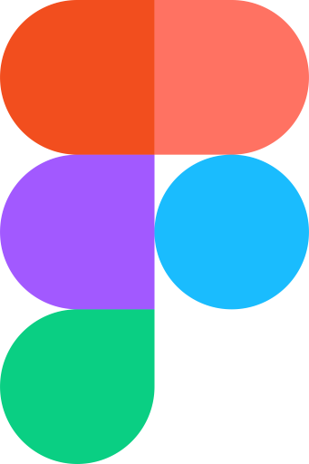
  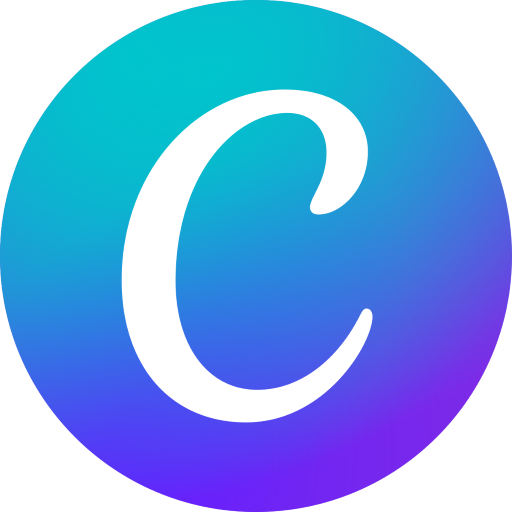
  
  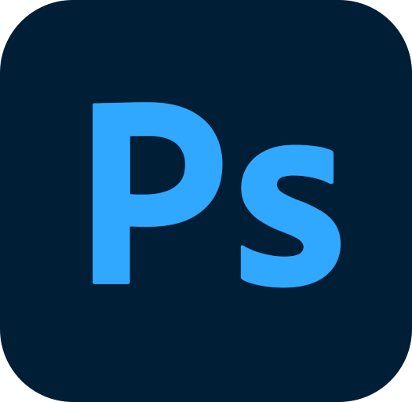

## 🔧 Command Line Interfaces (CLI)

  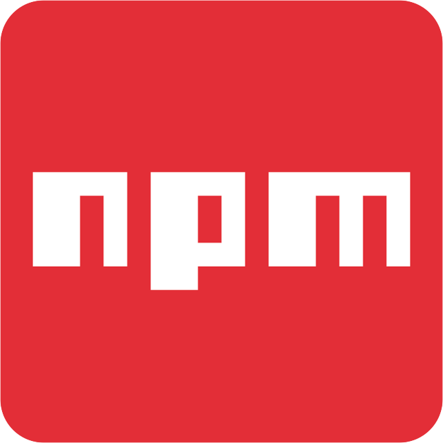
  
  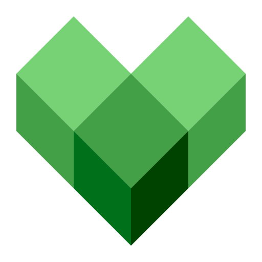

## 🚀 Runtimes

  
  

